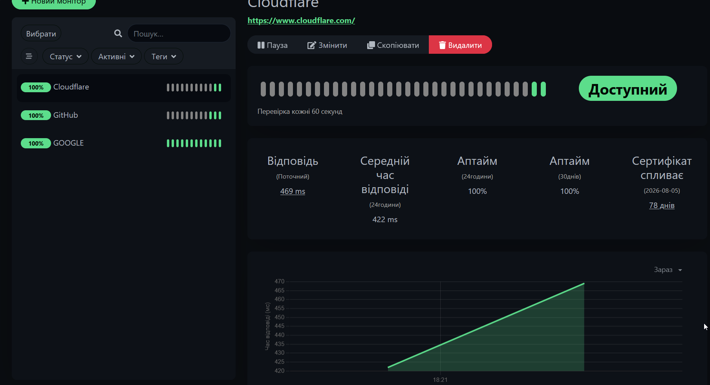

# 🖥️ Home Lab — Virtual Infrastructure

Personal home lab built on VirtualBox to practice real sysadmin skills.

## 🏗️ Infrastructure

| Machine | OS | IP | Role |
|---|---|---|---|
| ubuntu-server | Ubuntu 26.04 LTS | 192.168.56.10 | Server |
| windows-client1 | Windows 10 | 192.168.56.20 | Client |

## 🔧 What's running

**Ubuntu Server**
- SSH — remote management
- Docker — container platform
- Samba — file server (Windows ↔ Linux)
- Uptime Kuma — uptime monitoring dashboard

## 🌐 Network
| Device | Adapter | Type | IP |
|---|---|---|---|
| ubuntu-server | Adapter 1 | NAT | 10.0.2.15 |
| ubuntu-server | Adapter 2 | Internal Network | 192.168.56.10 |
| windows-client1 | Adapter 1 | Internal Network | 192.168.56.20 |

## 📊 Monitoring Dashboard



## 🖥️ SSH + Samba Server


## 🔗 Network Test + Mapped Drive


## 📁 Shared Drive on Windows Client


## 🛠️ Key commands used

```bash
# Network config
sudo nano /etc/netplan/50-cloud-init.yaml
sudo netplan apply

# Samba
sudo apt install samba -y
sudo mkdir /srv/shared
sudo chmod 777 /srv/shared
sudo systemctl restart smbd

# Docker + Uptime Kuma
sudo apt install docker.io -y
docker run -d --restart=always -p 3001:3001 \
  -v uptime-kuma:/app/data --name uptime-kuma \
  louislam/uptime-kuma:1
```
## ☁️ Home Server — Real Hardware

Personal home server built on old desktop PC for self-hosting services.

### 🖥️ Hardware

| Component | Spec |
|-----------|------|
| CPU | Intel Core 2 Duo |
| RAM | 8GB |
| Storage | SSD 232GB (OS) + HDD 149GB + HDD 372GB |

### 🐳 Docker Services

| Service | Port | Description |
|---------|------|-------------|
| Nextcloud | 8080 | Self-hosted cloud storage |
| Pi-hole | 80/53 | Network-wide ad blocking |

### 🗄️ Storage Setup

- HDD1 (`/dev/sda1`) — ext4, mounted at `/mnt/hdd1`, ~149GB
- HDD2 (`/dev/sdb1`) — ext4, mounted at `/mnt/hdd2`, ~372GB
- Both disks connected as Nextcloud External Storage with `www-data` ownership

### 🌐 Remote Access

- **Cloudflare Tunnel** — no port forwarding needed (double NAT workaround)
- **Domain:** `dronhomesrv.top` (registered on Porkbun, DNS on Cloudflare)
- **HTTPS** — automatic via Cloudflare
- **DuckDNS** — `dron4ik.duckdns.org` as backup

### 🔧 Key commands used

```bash
# Nextcloud External Storage
docker exec -u www-data nextcloud php occ app:enable files_external
docker exec -u www-data nextcloud php occ files_external:list

# Cloudflare Tunnel
cloudflared tunnel create homeserver
cloudflared tunnel route dns homeserver dronhomesrv.top
sudo cloudflared service install

# Fix HTTPS behind tunnel
docker exec -u www-data nextcloud php occ config:system:set overwriteprotocol --value=https
docker exec -u www-data nextcloud php occ config:system:set overwritehost --value=dronhomesrv.top

# Format disks to ext4
sudo mkfs.ext4 /dev/sda1
sudo chown -R www-data:www-data /mnt/hdd1
```
## 👤 Author

[lord-mega-dron](https://github.com/lord-mega-dron)
