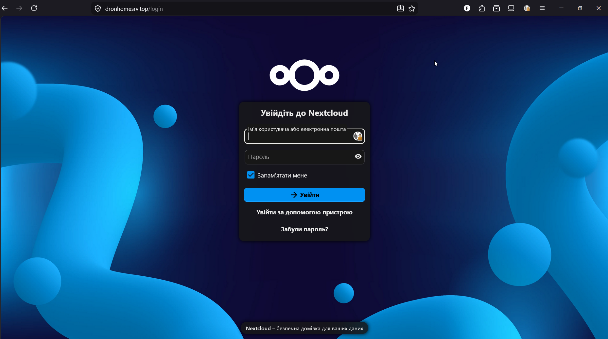
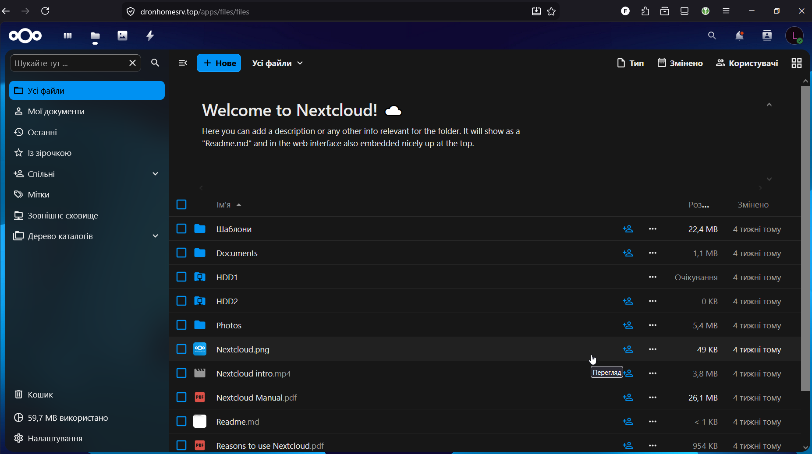
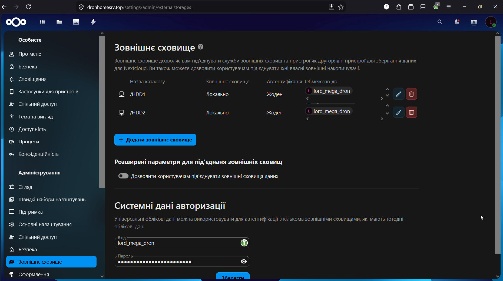
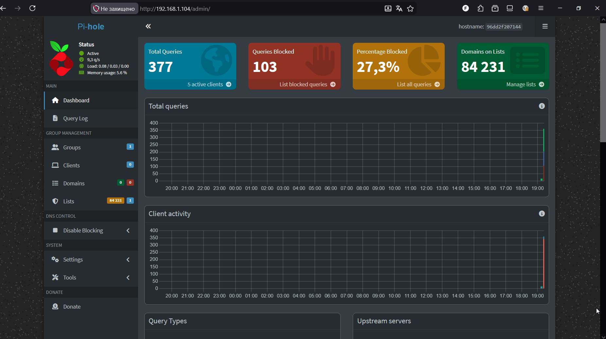
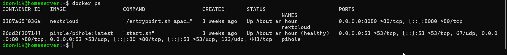
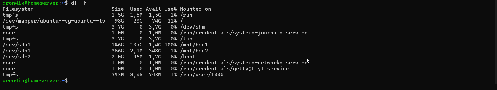
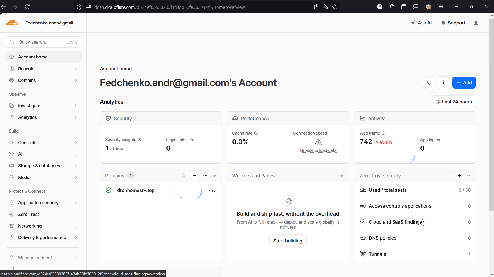

# 🖧 Home Server

Real home server built on old desktop PC for self-hosting services accessible from anywhere in the world.

## 🖥️ Hardware

| Component | Spec |
|-----------|------|
| CPU | Intel Core 2 Duo |
| RAM | 8GB |
| Storage | SSD 232GB (OS) + HDD 149GB + HDD 372GB |
| Network | Wired Ethernet, static IP 192.168.1.104 |
| OS | Ubuntu Server 26.04 LTS |

## 🐳 Docker Services

| Service | Port | Description |
|---------|------|-------------|
| Nextcloud | 8080 | Self-hosted cloud storage |
| Pi-hole | 80/53 | Network-wide ad blocking |

## 🌐 Remote Access

- **Domain:** `dronhomesrv.top`
- **HTTPS:** automatic via Cloudflare
- **Tunnel:** Cloudflare Tunnel (bypasses double NAT from ISP)
- **DNS:** Cloudflare + DuckDNS backup

## 🗄️ Storage

- HDD1 (`/dev/sda1`) — ext4, `/mnt/hdd1`, ~149GB
- HDD2 (`/dev/sdb1`) — ext4, `/mnt/hdd2`, ~372GB
- Both connected as Nextcloud External Storage

## 📸 Screenshots

### Nextcloud — accessible via HTTPS from anywhere


### Nextcloud — file manager with HDD1 and HDD2


### External Storage — both disks connected


### Pi-hole — network-wide ad blocking dashboard


### Docker — running containers


### Disk usage — mounted drives


### Cloudflare — tunnel active


### Nextcloud mobile — accessible from any network


## 🔧 Key commands

```bash
# Nextcloud External Storage
docker exec -u www-data nextcloud php occ app:enable files_external

# Cloudflare Tunnel
cloudflared tunnel create homeserver
cloudflared tunnel route dns homeserver dronhomesrv.top
sudo cloudflared service install

# Fix HTTPS behind tunnel
docker exec -u www-data nextcloud php occ config:system:set overwriteprotocol --value=https
docker exec -u www-data nextcloud php occ config:system:set overwritehost --value=dronhomesrv.top

# Format disks to ext4
sudo mkfs.ext4 /dev/sda1
sudo chown -R www-data:www-data /mnt/hdd1
```

## 🧠 Key learnings

- NTFS doesn't support Linux ownership (`chown`) — ext4 is required for proper permissions
- Double NAT from ISP blocks port forwarding — Cloudflare Tunnel solves this
- `overwriteprotocol` and `overwritehost` must be set in Nextcloud for correct HTTPS behavior behind a tunnel
