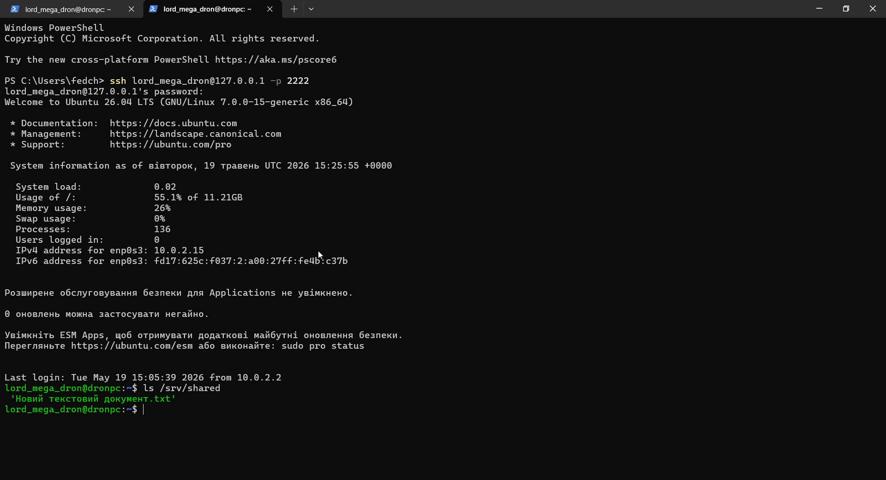
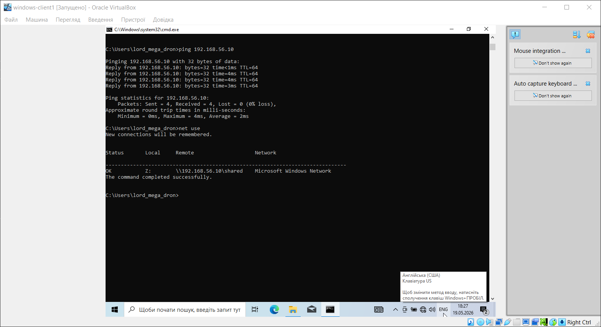
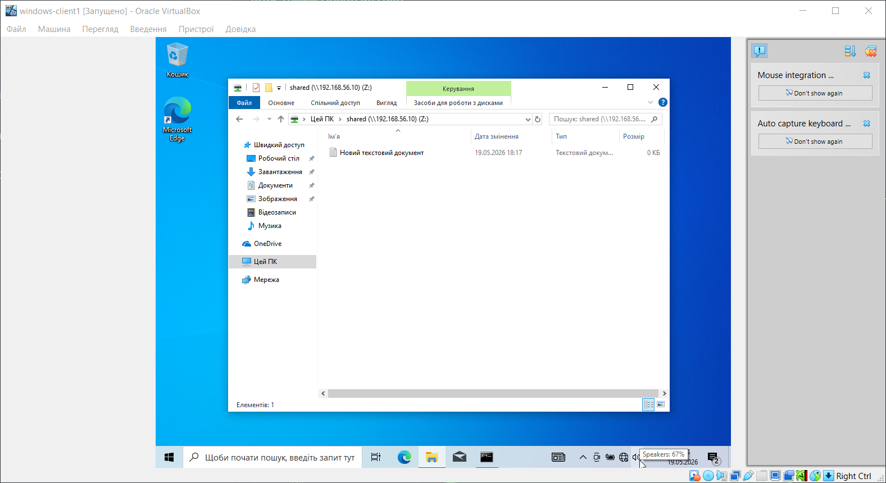

# 🖥️ Home Lab — Virtual Infrastructure

Personal home lab built on VirtualBox to practice real sysadmin skills.

## 🏗️ Infrastructure

| Machine | OS | IP | Role |
|---|---|---|---|
| ubuntu-server | Ubuntu 26.04 LTS | 192.168.56.10 | Server |
| windows-client1 | Windows 10 | 192.168.56.20 | Client |

## 🔧 What's running

**Ubuntu Server**
- SSH — remote management
- Docker — container platform
- Samba — file server (Windows ↔ Linux)
- Uptime Kuma — uptime monitoring dashboard

## 🌐 Network
| Device | Adapter | Type | IP |
|---|---|---|---|
| ubuntu-server | Adapter 1 | NAT | 10.0.2.15 |
| ubuntu-server | Adapter 2 | Internal Network | 192.168.56.10 |
| windows-client1 | Adapter 1 | Internal Network | 192.168.56.20 |

## 📊 Monitoring Dashboard


## 🖥️ SSH + Samba Server



## 🔗 Network Test + Mapped Drive



## 📁 Shared Drive on Windows Client



## 🛠️ Key commands used

```bash
# Network config
sudo nano /etc/netplan/50-cloud-init.yaml
sudo netplan apply

# Samba
sudo apt install samba -y
sudo mkdir /srv/shared
sudo chmod 777 /srv/shared
sudo systemctl restart smbd

# Docker + Uptime Kuma
sudo apt install docker.io -y
docker run -d --restart=always -p 3001:3001 \
  -v uptime-kuma:/app/data --name uptime-kuma \
  louislam/uptime-kuma:1
```
